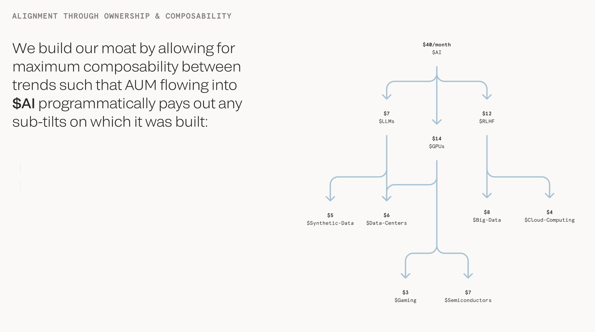

# Tilt Validator Specification

[Functional Decomposition and Morphological Matrix](Tilt Validator Specification/Functional Decomposition and Morphological Matrix)

Below is a **high-level specification** for implementing the validator logic in **Go**. It includes the major steps (subset selection, data gathering, computing distribution, partial signatures, and final aggregation) along with suggested **Go libraries** you might use for each component. This is just a **starting point**; you can adapt it to match your infrastructure, threshold-signature scheme, and naming conventions.

---

## 1. Overview

**Objective**: Implement a **validator node** that participates in the Tilt payment distribution flow. Each validator node:

1. Joins a selected **subset** of validators.
2. Gathers on-chain state from Solana.
3. Computes the final `(recipients[], amounts[])` distribution.
4. Generates a **partial signature** of the final message.
5. Sends partial signatures to an **aggregator** node to be merged into a single aggregated signature.

Finally, an **aggregator** broadcasts the signed transaction to the **Tilt program** on Solana.

---

## 2. Core Components and Recommended Libraries

1. **Solana RPC & On-Chain Data**
   - **Library**: [github.com/gagliardetto/solana-go](https://github.com/gagliardetto/solana-go) or [github.com/portto/solana-go-sdk](https://github.com/portto/solana-go-sdk)
   - **Usage**:
     - Establish an RPC client to connect to a Solana cluster (Mainnet, Testnet, Devnet, or localnet).
     - Fetch `AccountInfo` for the Tilt Program Derived Address (PDA), retrieving data such as:
       - Tilt’s balance
       - Business rules or ephemeral weighting
       - Sub-tilt references, etc.
2. **Threshold Signatures & Cryptography**
   - **Library (Possible Options)**:
     - [github.com/binance-chain/tss-lib](https://github.com/binance-chain/tss-lib) – for threshold ECDSA (commonly used for BTC/ETH, but can be adapted if you set up ECDSA-based solutions)
     - [crypto/ed25519](https://pkg.go.dev/crypto/ed25519) – built-in Go library for basic Ed25519 signing. _(Note: Go’s standard library does **not** provide a fully built-in threshold Ed25519; you may need third-party libs or multi-signature aggregator logic.)_
     - [golang.org/x/crypto](https://pkg.go.dev/golang.org/x/crypto) – extended cryptography packages, can be used for hashing, key derivation, etc.
   - **Usage**:
     - Each validator needs to hold a private key (or partial secret in a threshold scheme).
     - For threshold signatures (t-of-n), either use an **MPC-based** solution or a simpler approach like **multisig** on Solana (though that’s a different pattern than aggregated threshold sigs).
     - In an example aggregator flow, each validator signs the final distribution message with its private key, then sends the partial signature to the aggregator. The aggregator merges these signatures into a single valid signature if a threshold is met.
3. **Networking & Communication**
   - **Library**:
     - [github.com/libp2p/go-libp2p](https://github.com/libp2p/go-libp2p) – if you prefer a P2P network for validators to share data or partial signatures.
     - Or use standard **HTTP**/REST or **gRPC** with [google.golang.org/grpc](https://google.golang.org/grpc) to communicate partial signatures to the aggregator.
   - **Usage**:
     - Subset validators must exchange or send partial signatures to the aggregator.
     - The aggregator must broadcast the final transaction to the Solana cluster.
4. **Configuration & Logging**
   - **Library**:
     - [github.com/spf13/viper](https://github.com/spf13/viper) for managing configs.
     - [github.com/sirupsen/logrus](https://github.com/sirupsen/logrus) or [github.com/rs/zerolog](https://github.com/rs/zerolog) for structured logging.
   - **Usage**:
     - Store cluster endpoint, tilt program ID, aggregator addresses, threshold parameters, etc.
     - Uniform logging across all validator nodes and aggregator.

---

## 3. Data Structures

Below is a sample of the minimal data structures you might define in Go.

```go
package tilt

// Info about the tilt's state fetched from on-chain
type TiltState struct {
    Balance      uint64
    BusinessRules []byte
    // Additional fields as needed, e.g. ephemeral weighting, sub-tilt references
}

// The final distribution result that each validator computes
type Distribution struct {
    Recipients []string  // or use solana.PublicKey
    Amounts    []uint64
}

// Partial signature and metadata to correlate it with the final distribution
type PartialSignature struct {
    ValidatorID  string
    Signature    []byte
    Distribution Distribution
}

// Aggregated signature result
type AggregatedSignature struct {
    Signature    []byte  // single aggregated signature
    Distribution Distribution
}

```

---

## 4. Validator Node Flow

1. **Startup & Initialization**
   - Load config (cluster endpoint, tilt program ID, local private key).
   - Initialize Solana RPC client (e.g., `solana-go.NewClient(...)`).
   - Optionally join a P2P or register with an aggregator for partial signature submissions.
2. **(Optional) Subset Selection**
   - If the node is selected to be part of the k-of-n subset, it enters the distribution cycle.
   - Subset might be determined on-chain (e.g., VRF) or by an off-chain random selection process.
   - **Implementation detail**: You might store a local flag `IsSelected = true` if chosen.
3. **Data Gathering from Solana**

   ```go
   tiltAccountInfo, err := solanaClient.GetAccountInfo(context.Background(), tiltPDA)
   if err != nil {
       // handle error
   }
   tiltState := parseTiltState(tiltAccountInfo.Data)

   ```

   - The `parseTiltState(...)` function reads the program’s custom data format.
   - Retrieve `Balance`, `BusinessRules`, `DistributionHistory`, etc.

4. **Compute Distribution**
   - Using the tilt’s business rules, each validator arrives at the same `(recipients[], amounts[])`.
   - Example pseudocode:
     ```go
     func computeDistribution(state *TiltState) Distribution {
         // 1. Evaluate ephemeral weighting or rules
         // 2. Derive recipients (sub-tilts, creators, protocol fee, etc.)
         // 3. Return distribution
         return Distribution{ ... }
     }

     ```
   - Make sure all validators produce **identical** results.
5. **Partial Signature Generation**
   - Construct a **message** to sign that includes:
     - `tiltID`
     - `recipients[]`
     - `amounts[]`
     - Possibly a **nonce** or block hash to avoid replay
   - Sign with Ed25519 or ECDSA-based threshold scheme:
     ```go
     messageBytes := buildDistributionMessage(tiltID, distribution)
     sig := ed25519.Sign(privateKey, messageBytes)
     partialSig := PartialSignature{
         ValidatorID:  validatorID,
         Signature:    sig,
         Distribution: distribution,
     }

     ```
   - Transmit `partialSig` to the aggregator (via gRPC, P2P, or HTTP).
6. **Verification & Consensus**
   - Each validator or aggregator node can cross-check that all partial signatures are signing the **same** distribution array.
   - If any mismatch is detected, the aggregator might request a re-computation or raise an alert.
7. **Aggregator Receives Partial Signatures**
   - If using a **threshold signature library** (e.g., TSS, BLS, etc.), the aggregator will combine partial signatures into a single signature.
   - If using **multiple signatures** (like a Solana multisig approach), it might just collect them in a single transaction structure.
8. **Aggregator Broadcast**
   - The aggregator forms and broadcasts the final transaction:
     ```go
     tx := buildExecuteDistributionTransaction(
         tiltID,
         distribution.Recipients,
         distribution.Amounts,
         aggregatedSignature,
     )
     solanaClient.SendTransaction(context.Background(), tx)

     ```
   - The Tilt program verifies the aggregated signature on-chain and executes the distribution if valid.

---

## 5. Example Folder Structure

```
tilt/
 ┣ cmd/
 ┃ ┗ tilt-validator/
 ┃    ┣ main.go                 // CLI entry point for validator node
 ┣ pkg/
 ┃ ┣ aggregator/
 ┃ ┃ ┗ aggregator.go            // aggregator logic
 ┃ ┣ tss/
 ┃ ┃ ┗ partial_signature.go     // threshold signature logic
 ┃ ┣ solana/
 ┃ ┃ ┗ client.go                // wrapper around solana-go
 ┃ ┗ tiltlogic/
 ┃    ┣ distribution.go         // computeDistribution(...)
 ┃    ┗ state.go                // parseTiltState(...), data structs
 ┗ go.mod

```

---

## 6. Security & Best Practices

- **Key Management**: Protect validator private keys (potentially using HSM or a secure keystore).
- **Replay Protection**: Incorporate blockhash or a unique ID in the signed message.
- **Threshold**: Decide on `k-of-n` (e.g., 3-of-5) in your TSS config and ensure partial key shares are never exposed.
- **Data Consistency**: Double-check all validators have identical `TiltState` data before computing final distribution.

---

## 7. Extending the Spec

1. **Protocol Fee**: If 20% goes to the protocol, incorporate logic in `computeDistribution(...)` that calculates this portion for the foundation wallet or DAO.
2. **Re-tries & Timeouts**: If aggregator does not receive enough partial signatures within a certain window, it can alert or trigger a fallback aggregator.
3. **Governance Integration**: If on-chain governance modifies the rules, have your validator automatically fetch new logic from the tilt program’s account.
4. **Subset Selection**: If you want an on-chain VRF approach, integrate with a VRF oracle or a Dapp that commits the randomly selected validator set to Solana.

---

## Conclusion

This **Go-based validator specification** provides a blueprint for:

1. **Interacting with Solana** for on-chain data (using `solana-go`).
2. **Computing the distribution** deterministically.
3. **Generating partial signatures** (using threshold signature libraries or standard Ed25519 if you adopt a simpler aggregator approach).
4. **Aggregating** partial signatures and broadcasting the final transaction on-chain.

With the above structure and libraries, you can build out your own validator nodes, aggregator service, and robust distribution workflow for **Tilt**. Feel free to adapt naming conventions, data structures, and threshold signing logic to your specific requirements and security constraints.

Below is a **high-level specification** for implementing the validator logic in **Go**. It includes the major steps (subset selection, data gathering, computing distribution, partial signatures, and final aggregation) along with suggested **Go libraries** you might use for each component. This is just a **starting point**; you can adapt it to match your infrastructure, threshold-signature scheme, and naming conventions.

---

## 1. Overview

**Objective**: Implement a **validator node** that participates in the Tilt payment distribution flow. Each validator node:

1. Joins a selected **subset** of validators.
2. Gathers on-chain state from Solana.
3. Computes the final `(recipients[], amounts[])` distribution.
4. Generates a **partial signature** of the final message.
5. Sends partial signatures to an **aggregator** node to be merged into a single aggregated signature.

Finally, an **aggregator** broadcasts the signed transaction to the **Tilt program** on Solana.

---

## 2. Core Components and Recommended Libraries

1. **Solana RPC & On-Chain Data**
   - **Library**: [github.com/gagliardetto/solana-go](https://github.com/gagliardetto/solana-go) or [github.com/portto/solana-go-sdk](https://github.com/portto/solana-go-sdk)
   - **Usage**:
     - Establish an RPC client to connect to a Solana cluster (Mainnet, Testnet, Devnet, or localnet).
     - Fetch `AccountInfo` for the Tilt Program Derived Address (PDA), retrieving data such as:
       - Tilt’s balance
       - Business rules or ephemeral weighting
       - Sub-tilt references, etc.
2. **Threshold Signatures & Cryptography**
   - **Library (Possible Options)**:
     - [github.com/binance-chain/tss-lib](https://github.com/binance-chain/tss-lib) – for threshold ECDSA (commonly used for BTC/ETH, but can be adapted if you set up ECDSA-based solutions)
     - [crypto/ed25519](https://pkg.go.dev/crypto/ed25519) – built-in Go library for basic Ed25519 signing. _(Note: Go’s standard library does **not** provide a fully built-in threshold Ed25519; you may need third-party libs or multi-signature aggregator logic.)_
     - [golang.org/x/crypto](https://pkg.go.dev/golang.org/x/crypto) – extended cryptography packages, can be used for hashing, key derivation, etc.
   - **Usage**:
     - Each validator needs to hold a private key (or partial secret in a threshold scheme).
     - For threshold signatures (t-of-n), either use an **MPC-based** solution or a simpler approach like **multisig** on Solana (though that’s a different pattern than aggregated threshold sigs).
     - In an example aggregator flow, each validator signs the final distribution message with its private key, then sends the partial signature to the aggregator. The aggregator merges these signatures into a single valid signature if a threshold is met.
3. **Networking & Communication**
   - **Library**:
     - [github.com/libp2p/go-libp2p](https://github.com/libp2p/go-libp2p) – if you prefer a P2P network for validators to share data or partial signatures.
     - Or use standard **HTTP**/REST or **gRPC** with [google.golang.org/grpc](https://google.golang.org/grpc) to communicate partial signatures to the aggregator.
   - **Usage**:
     - Subset validators must exchange or send partial signatures to the aggregator.
     - The aggregator must broadcast the final transaction to the Solana cluster.
4. **Configuration & Logging**
   - **Library**:
     - [github.com/spf13/viper](https://github.com/spf13/viper) for managing configs.
     - [github.com/sirupsen/logrus](https://github.com/sirupsen/logrus) or [github.com/rs/zerolog](https://github.com/rs/zerolog) for structured logging.
   - **Usage**:
     - Store cluster endpoint, tilt program ID, aggregator addresses, threshold parameters, etc.
     - Uniform logging across all validator nodes and aggregator.

---

## 3. Data Structures

Below is a sample of the minimal data structures you might define in Go.

```go
package tilt

// Info about the tilt's state fetched from on-chain
type TiltState struct {
    Balance      uint64
    BusinessRules []byte
    // Additional fields as needed, e.g. ephemeral weighting, sub-tilt references
}

// The final distribution result that each validator computes
type Distribution struct {
    Recipients []string  // or use solana.PublicKey
    Amounts    []uint64
}

// Partial signature and metadata to correlate it with the final distribution
type PartialSignature struct {
    ValidatorID  string
    Signature    []byte
    Distribution Distribution
}

// Aggregated signature result
type AggregatedSignature struct {
    Signature    []byte  // single aggregated signature
    Distribution Distribution
}

```

---

## 4. Validator Node Flow

1. **Startup & Initialization**
   - Load config (cluster endpoint, tilt program ID, local private key).
   - Initialize Solana RPC client (e.g., `solana-go.NewClient(...)`).
   - Optionally join a P2P or register with an aggregator for partial signature submissions.
2. **(Optional) Subset Selection**
   - If the node is selected to be part of the k-of-n subset, it enters the distribution cycle.
   - Subset might be determined on-chain (e.g., VRF) or by an off-chain random selection process.
   - **Implementation detail**: You might store a local flag `IsSelected = true` if chosen.
3. **Data Gathering from Solana**

   ```go
   tiltAccountInfo, err := solanaClient.GetAccountInfo(context.Background(), tiltPDA)
   if err != nil {
       // handle error
   }
   tiltState := parseTiltState(tiltAccountInfo.Data)

   ```

   - The `parseTiltState(...)` function reads the program’s custom data format.
   - Retrieve `Balance`, `BusinessRules`, `DistributionHistory`, etc.

4. **Compute Distribution**
   - Using the tilt’s business rules, each validator arrives at the same `(recipients[], amounts[])`.
   - Example pseudocode:
     ```go
     func computeDistribution(state *TiltState) Distribution {
         // 1. Evaluate ephemeral weighting or rules
         // 2. Derive recipients (sub-tilts, creators, protocol fee, etc.)
         // 3. Return distribution
         return Distribution{ ... }
     }

     ```
   - Make sure all validators produce **identical** results.
5. **Partial Signature Generation**
   - Construct a **message** to sign that includes:
     - `tiltID`
     - `recipients[]`
     - `amounts[]`
     - Possibly a **nonce** or block hash to avoid replay
   - Sign with Ed25519 or ECDSA-based threshold scheme:
     ```go
     messageBytes := buildDistributionMessage(tiltID, distribution)
     sig := ed25519.Sign(privateKey, messageBytes)
     partialSig := PartialSignature{
         ValidatorID:  validatorID,
         Signature:    sig,
         Distribution: distribution,
     }

     ```
   - Transmit `partialSig` to the aggregator (via gRPC, P2P, or HTTP).
6. **Verification & Consensus**
   - Each validator or aggregator node can cross-check that all partial signatures are signing the **same** distribution array.
   - If any mismatch is detected, the aggregator might request a re-computation or raise an alert.
7. **Aggregator Receives Partial Signatures**
   - If using a **threshold signature library** (e.g., TSS, BLS, etc.), the aggregator will combine partial signatures into a single signature.
   - If using **multiple signatures** (like a Solana multisig approach), it might just collect them in a single transaction structure.
8. **Aggregator Broadcast**
   - The aggregator forms and broadcasts the final transaction:
     ```go
     tx := buildExecuteDistributionTransaction(
         tiltID,
         distribution.Recipients,
         distribution.Amounts,
         aggregatedSignature,
     )
     solanaClient.SendTransaction(context.Background(), tx)

     ```
   - The Tilt program verifies the aggregated signature on-chain and executes the distribution if valid.

---

## 5. Example Folder Structure

```
tilt/
 ┣ cmd/
 ┃ ┗ tilt-validator/
 ┃    ┣ main.go                 // CLI entry point for validator node
 ┣ pkg/
 ┃ ┣ aggregator/
 ┃ ┃ ┗ aggregator.go            // aggregator logic
 ┃ ┣ tss/
 ┃ ┃ ┗ partial_signature.go     // threshold signature logic
 ┃ ┣ solana/
 ┃ ┃ ┗ client.go                // wrapper around solana-go
 ┃ ┗ tiltlogic/
 ┃    ┣ distribution.go         // computeDistribution(...)
 ┃    ┗ state.go                // parseTiltState(...), data structs
 ┗ go.mod

```

---

## 6. Security & Best Practices

- **Key Management**: Protect validator private keys (potentially using HSM or a secure keystore).
- **Replay Protection**: Incorporate blockhash or a unique ID in the signed message.
- **Threshold**: Decide on `k-of-n` (e.g., 3-of-5) in your TSS config and ensure partial key shares are never exposed.
- **Data Consistency**: Double-check all validators have identical `TiltState` data before computing final distribution.

---

## 7. Extending the Spec

1. **Protocol Fee**: If 20% goes to the protocol, incorporate logic in `computeDistribution(...)` that calculates this portion for the foundation wallet or DAO.
2. **Re-tries & Timeouts**: If aggregator does not receive enough partial signatures within a certain window, it can alert or trigger a fallback aggregator.
3. **Governance Integration**: If on-chain governance modifies the rules, have your validator automatically fetch new logic from the tilt program’s account.
4. **Subset Selection**: If you want an on-chain VRF approach, integrate with a VRF oracle or a Dapp that commits the randomly selected validator set to Solana.

---

## Conclusion

This **Go-based validator specification** provides a blueprint for:

1. **Interacting with Solana** for on-chain data (using `solana-go`).
2. **Computing the distribution** deterministically.
3. **Generating partial signatures** (using threshold signature libraries or standard Ed25519 if you adopt a simpler aggregator approach).
4. **Aggregating** partial signatures and broadcasting the final transaction on-chain.

With the above structure and libraries, you can build out your own validator nodes, aggregator service, and robust distribution workflow for **Tilt**. Feel free to adapt naming conventions, data structures, and threshold signing logic to your specific requirements and security constraints.

[Validator Sequence Diagram](Tilt Validator Specification/Validator Sequence Diagram )

[Validator Distribution Logic](Tilt Validator Specification/Validator Distribution Logic )

[Validator - Program Interaction](Tilt Validator Specification/Validator - Program Interaction )

[Valudator options](Tilt Validator Specification/Valudator options )

[Dynamic Distributions - Ephemeral values vs business rules](Tilt Validator Specification/Dynamic Distributions - Ephemeral values vs busine )

# 1. Vision & Scope: Validator Specification

This **Validator Specification** outlines how a **pool of staked validators** securely finalizes tilt distributions in a **decentralized** and **threshold-based** manner. It details the high-level design goals, the responsibilities between off-chain validator processes and on-chain checks, and the roles (validator pool, random subset, aggregator, etc.) involved in ensuring each distribution is correct and tamper-resistant.



We need to ensure that attribution is reflective of a tilt’s state. A tilt’s state changes moment-to-moment. A t=0, a tilt’s state may show that 75% of the tilt is actually [composed of other tilts](https://www.notion.so/71bbb1cadfab4e4e8b5d3830ee1801f6?pvs=21) and only 25% is a thematic expression unique to the creators/curators.

One way to think about that, might be to consider a default “splitting” ratio amongst the stakeholders groups (e.g. 20% to the protocol, 40% to the curators, 40% to the publishers) and simply treat any sub-tilts as data publishers, but in the specific example above, this would unfairly benefit the curators who did very little work other than to assemble pre-existing tilts.

I think the right approach is to treat sub-tilts as part of the curator stakeholder group such that the 40% that the curators are entitled to, would subsequently be split into a 25:75 ratio (for the example above). That would mean 10% (in absolute terms) to the tilt curator(s) and 30% to the sub-tilt curator(s).

The challenge will be the tilt curator(s) can meddle with their dependency weights at any time and need to have that ability as well. Thus, the need for “state” in the attribution calculation.

---

## 1.1 Purpose & Business Goal

The primary goal of the **Validator system** is to:

1. **Provide a Decentralized & Trust-Minimized Distribution Mechanism**
   - Avoid depending on any single trusted address.
   - Rely on an M-of-N threshold signature scheme so no single validator can unilaterally push malicious distributions.
2. **Off-Chain Collaboration, On-Chain Enforcement**
   - Compute complex or dynamic distributions off-chain, allowing sophisticated logic.
   - Finalize the distribution with a single on-chain transaction containing a verified **aggregated signature**.
3. **Random Subset & Rotation**
   - For each tilt distribution, a smaller group (K-of-N) is randomly chosen from the entire pool of validators, ensuring no entity can pre-decide who finalizes.
   - This random selection prevents collusion or capture of the validation process by a small group.
4. **Efficient One-Transaction Settlement**
   - Only one broadcasted transaction is needed to finalize a distribution on-chain.
   - Minimizes fees and network usage while maintaining robust security.

**Business Goals**

- **Decentralized Security**: Each distribution must be signed by M-of-N, preventing single points of failure.
- **Scalability**: Off-chain partial signature aggregation reduces the load on the tilt program.
- **Flexible Distribution Logic**: The system can accommodate various payout formulas or curation algorithms (on the validator side), as the contract only checks the final signature plus basic constraints (e.g., total deposit, KYC checks).

---

## 1.2 Off-Chain vs. On-Chain Responsibilities

Although the tilt program (smart contract) enforces **signature checks** and final fund movements, the validator side primarily operates **off-chain**:

### 1.2.1 Off-Chain Responsibilities

1. **Validator Pool Management**
   - Validators must stake tokens or be recognized to join the pool.
   - Subset selection (random or otherwise) to form a smaller distribution committee for each tilt’s payout.
2. **Distribution Computation**
   - The chosen subset retrieves deposit and tilt data via RPC.
   - Applies the tilt’s distribution formula or advanced logic (profit-sharing, curation, etc.).
3. **Threshold Signature Generation**
   - Each validator in the subset partial-signs the distribution message.
   - One node (the “aggregator”) merges these partial signatures into a single aggregated signature.
4. **Designated Broadcaster**
   - Only one validator (or aggregator) pays network fees and submits the final transaction on-chain.
   - The rest of the subset monitors the broadcast for correctness.

### 1.2.2 On-Chain Responsibilities (Tilt Program)

1. **Store Subset Key or Committee Info**
   - The tilt account might reference which subset or ephemeral public key is valid for that distribution.
2. **Verify Aggregated Signature**
   - The program checks that the signature indeed corresponds to the correct subset and message.
3. **Finalize Payout**
   - If valid, the contract transfers lamports accordingly.
   - If not valid, it rejects the transaction.

---

## 1.3 Participants & Roles (Validator-Focused)

1. **Validator Pool**
   - The overarching group of staked participants, each holding a share in some threshold cryptosystem.
   - The system might define a large N (e.g., 100 or more) from which smaller subsets are chosen for each distribution.
2. **Random Subset**
   - For a given tilt distribution, a smaller subset of size K is randomly drawn from the pool (e.g., 10 out of 100).
   - They coordinate off-chain to compute the final distribution and produce partial signatures.
3. **Designated Broadcaster**
   - A single node among the subset is chosen to submit the final transaction.
   - Pays the Solana network fee and includes the aggregated signature.
   - The rest of the subset observes the transaction to ensure no tampering.
4. **Aggregator**
   - Possibly the same as the designated broadcaster or a different node who merges partial signatures into one final aggregated signature.
   - Responsible for verifying partial signatures off-chain and ensuring M-of-K coverage is reached.
5. **Security & Slashing (Optional)**
   - If a malicious subset tries to finalize a fraudulent distribution, the protocol can slash them if it detects wrongdoing (e.g., by comparing the on-chain message to any off-chain logs or partial signatures published).

---

## 1.4 High-Level Functions & Workflow

1. **Subset Selection**
   - A random or VRF-based mechanism picks K validators from the entire pool for each tilt distribution.
   - Off-chain or on-chain logic sets a “committee public key” (if needed) so the tilt program knows which aggregated signature to trust.
2. **Distribution Calculation**
   - Subset members fetch deposit data from the tilt account.
   - They compute `(recipients[], amounts[])` according to off-chain logic (deterministic or otherwise).
3. **Partial Signatures**
   - Each validator uses their private key share to sign `(tiltID, recipients, amounts, nonce)`.
   - A single aggregator merges these partial signatures into a final threshold signature.
4. **Broadcast & Verification**
   - The designated validator sends `execute_distribution(tiltPDA, recipients, amounts, aggregatedSig)` to Solana.
   - The tilt program verifies that `aggregatedSig` matches the committee’s group public key and references the correct distribution data.
   - If valid, the tilt program transfers funds accordingly.
5. **Monitoring & Error Handling**
   - If the designated validator fails to broadcast or tries to tamper with the distribution, the aggregated signature becomes invalid. The rest of the subset can re-elect a new broadcaster or recast partial signatures if needed.
   - If insufficient partial signatures are gathered (some validators are offline), the system might define a fallback or a re-selection process.

---

# 2. Scope (Validator Specification)

This section defines which components and operations of the **validator system** are covered by this specification and which are deliberately excluded. It also provides a high-level workflow describing how validators collaborate to produce a final threshold signature.

---

## 2.1 In-Scope

1. **Validator Pool & Membership**
   - How validators become part of the system (e.g., staking, registering).
   - The existence of a large N-member pool from which subsets are selected for each distribution event.
2. **Subset Selection & Rotation**
   - The mechanism (random, VRF-based, or otherwise) by which a smaller group (K out of N) is chosen for a given tilt distribution.
   - How frequently and under what conditions the subset membership changes or rotates (e.g., each distribution, each epoch).
3. **Off-Chain Collaboration**
   - The process by which the chosen validator subset gathers **on-chain deposit data** from the tilt program, runs local computations (e.g., distribution formulas), and arrives at `(recipients[], amounts[])`.
   - Communication methods (peer-to-peer) for exchanging partial signatures, verifying each other’s partial results, etc.
4. **Threshold Signature Protocol**
   - The overall approach (BLS, threshold ECDSA, or another cryptoscheme) used for partial signature generation and aggregation.
   - Off-chain key management details and partial signature creation flow, culminating in a single aggregated signature.
   - Basic handling of aggregator responsibilities (collecting partial sigs, verifying them, forming the final signature).
5. **Single Broadcaster Model**
   - Random or formula-based selection of **one** validator from the subset to pay network fees and broadcast the final distribution transaction on-chain.
   - The rest of the subset monitors this broadcast for correctness.
6. **Error Handling & Fallbacks**
   - Edge cases like a designated broadcaster going offline, insufficient partial signatures (M-of-K not met), or re-randomizing a new subset after timeouts.
   - Potential slashing or penalty logic if validators sign fraudulent distributions (optional and up to the broader protocol design).
7. **Integration with On-Chain Checks**
   - The final threshold signature is attached to the on-chain `execute_distribution(...)` call in the tilt program.
   - Basic constraints the tilt program enforces (e.g., verifying the aggregated signature, checking deposit balances, tilt status).

---

## 2.2 Out of Scope

1. **User Interface & Front-End**
   - The specification does not cover UI flows or front-end designs for validator dashboards.
   - It only describes back-end protocols and cryptographic steps.
2. **Exact Randomness Source Implementation**
   - While we require a random or VRF-based selection method for subsets, the detailed RNG design (e.g., chain VRF, committee-based beacon) may be addressed in a separate spec.
   - This spec assumes the existence of a secure random selection mechanism but does not define it fully.
3. **Staking Economics & Tokenomics**
   - The specifics of how validators stake tokens, earn rewards, or get slashed are high-level references here but not described in detail.
   - Econometric modeling, APYs, or inflation schedules lie outside this scope.
4. **Detailed Cryptographic Libraries**
   - While we reference BLS or threshold ECDSA, the actual library code (pairing check, elliptical curve arithmetic) is assumed external or in a separate “crypto module.”
   - The specification only addresses the usage pattern, not the low-level cryptographic internals.
5. **Full On-Chain Tilt Program Logic**
   - The tilt smart contract is summarized only insofar as validators must interact with it (submit final signatures, call `execute_distribution(...)`).
   - The entire tilt contract code and other roles (Admin, Creator, etc.) are documented in the separate **Tilt Specification**.
6. **Compliance & KYC**
   - This specification focuses on the distribution validation.
   - Compliance checks or KYC gating are external concerns, enforced by the tilt program or an off-chain compliance module.

---

## 2.3 Workflow Overview

The following high-level steps illustrate how a **chosen subset** of validators collaborates off-chain to finalize a tilt distribution, culminating in a single on-chain submission.

### 2.3.1 High-Level Workflow Steps

1. **Subset Selection**
   - A random or protocol-defined method picks K validators from the broader pool of size N.
   - Off-chain or minimal on-chain references confirm this subset is authorized for the next distribution.
2. **Data Retrieval & Computation (Off-Chain)**
   - The K validators each fetch deposit balances and tilt metadata from the Solana network (via RPC).
   - They compute `(recipients[], amounts[])` using the tilt’s distribution logic (pro-rata shares, curation scoring, etc.).
3. **Partial Signatures**
   - Each validator signs `(tilt_id, recipients, amounts, nonce/timestamp)` with their partial key share.
   - They share these partial signatures among themselves, verifying correctness.
4. **Aggregation**
   - Once M partial signatures are collected, an aggregator node merges them into **one** aggregated signature.
   - The aggregator can also validate each partial sig.
5. **Broadcast**
   - A single designated validator (the “broadcaster”) includes the final `(recipients, amounts, aggregatedSig)` in a transaction to the tilt program’s `execute_distribution(...)`.
   - They pay the Solana network fee and finalize the transaction.
6. **On-Chain Verification**
   - The tilt program checks the aggregated signature against the subset’s ephemeral or group public key.
   - If it matches and basic checks (tilt status, deposit limit, etc.) pass, the contract disburses funds.

---

### 2.3.2 On-Chain vs. Off-Chain Steps

| **Step**                       | **Location**                 | **Description**                                                                                                |
| ------------------------------ | ---------------------------- | -------------------------------------------------------------------------------------------------------------- |
| **Subset Selection**           | Off-Chain / Partial On-Chain | A random or VRF-based approach picks K out of N. Possibly store ephemeral group pubkey on-chain for reference. |
| **Data Gathering**             | Off-Chain                    | Chosen validators read tilt account info from Solana RPC, plus any off-chain formula details.                  |
| **Compute Distribution**       | Off-Chain                    | Subset members converge on `(recipients[], amounts[])`.                                                        |
| **Partial Sigs & Aggregation** | Off-Chain                    | M-of-K partial sig generation, aggregator merges them into one threshold signature.                            |
| **Broadcast**                  | Off-Chain -> On-Chain        | A single validator calls `execute_distribution(...)` with `(recipients, amounts, aggregatedSig)`.              |
| **Signature Verification**     | On-Chain                     | The tilt program checks the aggregated signature and final distribution. If valid, it executes the payout.     |

---

## 2.4 Example Subset Randomness & Fallbacks

1. **Random Source**
   - Could be an on-chain VRF oracle or an off-chain aggregator that publishes random seeds on-chain.
   - A separate “committee manager” might store ephemeral public keys or the chosen validator addresses in the tilt’s state.
2. **No-Show Validators**
   - If some subset members fail to sign or go offline, you might re-randomize or wait until enough partial signatures are collected.
   - If the aggregator doesn’t broadcast, the remaining subset can elect a new aggregator or designate a fallback node.
3. **Time-Based or Tilt-Specific**
   - Each tilt might have a time window for distribution. If it expires, a new subset is selected, or an override mechanism triggers a different finalization approach.

---

## 2.5 Security & Trust Model

1. **No Single Validator**
   - With an M-of-K threshold, no one can single-handedly push a fraudulent distribution.
   - Attackers must compromise at least M validators in a subset to produce an invalid signature.
2. **Honest Majority Assumption**
   - If the majority (or at least M) of validators are honest, the final distribution is correct.
   - Observers or other nodes can detect collusion if the aggregator tries to tamper with the final message, as the aggregated signature won’t match.
3. **Fallback & Slashing**
   - Optional: If a malicious subset signs a fraudulent distribution, the protocol might slash staked tokens.
   - If no distribution is submitted before a deadline, the system can re-select a new subset or escalate to a fallback method.

---

# 3. Detailed Protocol Steps & Data Structures (Validator Specification)

This section provides a deeper look at **how** validators collaborate off-chain to produce a threshold signature, how subsets are managed, and which data structures or messages might be stored or exchanged. It extends the high-level workflow from Section 2 with more concrete steps and optional mechanisms.

---

## 3.1 Key Management & Threshold Setup

1. **Distributed Key Generation (DKG)**
   - Each validator obtains a share of a **group private key** via an off-chain DKG protocol (e.g., Gennaro, FROST).
   - The entire validator pool thus shares an M-of-N threshold scheme. If you plan to rotate membership or re-randomize subsets often, each subset might perform an ephemeral DKG.
2. **Maintaining Staked Validator Membership**
   - A “Validator Pool Manager” (on-chain or off-chain) might track who is currently staked and thus eligible for selection.
   - If a validator joins or leaves, a new DKG might be required, or you rely on ephemeral per-subset keys so the global key does not need frequent regeneration.
3. **Security Considerations**
   - Each validator must protect its partial key share.
   - If partial key shares leak, an attacker could impersonate that validator in the threshold signature scheme.

---

## 3.2 Committee Selection & Public Key Registration

1. **Subset Size (K of N)**
   - The entire pool might have N validators. For each distribution event, a random or VRF-based approach selects K participants.
   - The threshold M (within K) is typically M ≤ K to sign the distribution message.
2. **Ephemeral Public Key**
   - Once K validators are chosen, they can run a mini-DKG (if needed) to derive an **ephemeral group public key**.
   - This ephemeral key is known only to them but can be **registered** on-chain in the relevant tilt’s account, so the tilt program knows which signature to expect.
3. **On-Chain vs. Off-Chain Storage**
   - **On-Chain**: The tilt program stores `committeePubKey`, referencing the ephemeral BLS or threshold ECDSA public key.
   - **Off-Chain**: The subset might keep track of the random seed or selection result, only storing minimal references on-chain to reduce cost.

---

## 3.3 Partial Signature Generation & Aggregation

Below are the **key steps** once the subset is chosen:

1. **Distribution Calculation**
   - Each validator in the subset fetches on-chain deposit data (via RPC).
   - They run the tilt’s distribution logic (e.g., pro-rata shares, curation ranking) to get `(recipients[], amounts[])`.
2. **Form the Message**
   - The subset agrees on a message including `(tiltID, recipients, amounts, nonce/timestamp)`.
   - A “nonce” or “timestamp” prevents replay or confusion with prior distributions.
3. **Partial Signing**
   - Each validator uses its partial private key to sign the message.
   - The signature is usually a short piece of data (e.g., 32–96 bytes, depending on BLS or ECDSA curves).
4. **Verification** (Off-Chain)
   - Subset members verify each other’s partial signatures, ensuring no rogue signature is introduced.
   - If a partial signature fails, it’s discarded or reported.
5. **Aggregation**
   - Once at least **M** partial signatures are valid, an aggregator node combines them into a single aggregated signature (`aggregatedSig`).
   - The aggregator can also store which subset members contributed partial signatures for auditing or slashing logic if needed.

---

## 3.4 Broadcasting & Execution

1. **Designated Broadcaster**
   - One node in the subset (randomly chosen or agreed upon) pays the Solana network fee and submits the final transaction.
   - They attach `(recipients, amounts, aggregatedSig)` in the call to the tilt program’s `execute_distribution(...)`.
2. **On-Chain Verification**
   - The tilt program retrieves the ephemeral subset pubkey from its tilt state (or from a committee manager).
   - Runs a threshold signature check (BLS pairing or threshold ECDSA verification).
   - If valid, it ensures `sum(amounts[]) <= tiltBalance`, tilt isn’t frozen, etc.
   - Funds are distributed accordingly, and a `DistributionExecuted(...)` event is emitted.
3. **Monitoring & Confirmation**
   - Other subset members watch the broadcast transaction (via mempool or final ledger).
   - If the designated broadcaster tries to tamper with `(recipients[], amounts[])`, the aggregated signature fails verification on-chain.
   - If they fail to broadcast at all, a fallback aggregator might step in (depending on policy).

---

## 3.5 Data Structures & Message Formats

1. **Off-Chain Partial Signature**

   ```
   {
     validator_index: number,
     partial_signature: bytes
   }

   ```

   - The aggregator collects multiple such items from M different validators.

2. **Aggregated Signature**

   ```
   {
     aggregatedSig: bytes,
     subsetPubKey: bytes   // ephemeral subset's public key
   }

   ```

   - Optionally, the aggregator includes a proof or list of signers for off-chain auditing.

3. **Committee State (On-Chain or Off-Chain)**
   - If ephemeral keys are used, the tilt’s PDA might store:
     ```rust
     pub struct CommitteeState {
       pub ephemeral_pubkey: [u8; ...],
       pub chosen_validators: [Pubkey; K], // optional if needed
       // ... any relevant flags
     }

     ```
   - If no ephemeral keys are used, a global “Pool Manager” could store each validator’s partial public key, and the tilt program references which K-of-N was selected.
4. **Distribution Message** (Off-Chain)

   ```
   {
     tilt_id: u64,
     recipients: [Pubkey],
     amounts: [u64],
     nonce: u64,
     // possibly other fields like distribution_type, etc.
   }

   ```

   - Signed by the M-of-K subset. The aggregator merges these partial signatures.

---

## 3.6 Handling Errors & Fallbacks

1. **Insufficient Partial Signatures**
   - If M partial signatures are never collected, no valid aggregated signature is formed.
   - After a timeout, the system might reselect a new subset or fall back to an alternative finalization approach (like an admin override).
2. **Broadcast Failure**
   - If the designated broadcaster fails to submit, another node from the subset can broadcast the same aggregated signature.
   - The on-chain tilt program only cares about verifying the signature, not which node sends it.
3. **Rotation / Expired Committee**
   - If a tilt is not distributed by a certain deadline, the old subset may expire.
   - A new subset is chosen, forming a new ephemeral key. The tilt program updates its committee data (if using ephemeral storage).
4. **Slashing / Penalties**
   - If a malicious subset tries to push a fraudulent distribution, the resulting aggregator signature is invalid.
   - If they collude to produce an actual valid signature with the wrong data, that implies M or more are compromised—leading to protocol-level slash or fork. This scenario is typically rare if the honest majority assumption holds.

---

## 3.7 Summary of Off-Chain vs. On-Chain Responsibilities

- **Off-Chain**:
  - DKG or ephemeral key generation for each subset.
  - Subset selection, partial signature exchange, aggregator merges.
  - Single broadcast transaction.
- **On-Chain**:
  - (Optional) Storing ephemeral public keys or chosen validator addresses.
  - Verifying the aggregated signature in `execute_distribution(...)`.
  - Enforcing tilt-level constraints (balance, status, KYC checks).

# 4. Implementation & Integration (Validator Specification)

This section provides guidance on how to **implement** the off-chain validator protocols described in Sections 2 and 3, how they **integrate** with the tilt program on-chain, and what optional modules or considerations can enhance security and reliability.

---

## 4.1 Off-Chain Validator Orchestration

1. **Orchestrator / Node Software**
   - Each validator runs software that **stores** or **manages** its threshold key share, communicates with peers for partial signatures, and **monitors** Solana’s RPC for new tilt distributions.
   - This software may be a dedicated service or integrated into an existing node setup, as long as it can retrieve tilt data and produce partial signatures.
2. **Subset Coordination**
   - Once a K-of-N subset is chosen, these K members run a mini-protocol to:
     1. Confirm each other’s membership (e.g., verifying they are indeed part of the random selection).
     2. Exchange ephemeral key data if a new DKG is needed.
     3. Agree on aggregator roles (who merges partial signatures, who pays fees).
3. **Network Layer**
   - Validators can communicate via a peer-to-peer protocol or a simpler client-server approach (e.g., a secure REST or gRPC channel).
   - The critical point is reliable exchange of partial signatures and distribution messages, ensuring no single node can cause indefinite deadlock by withholding data.

---

## 4.2 On-Chain Integration with the Tilt Program

1. **Committee Registration (Optional)**
   - If the design uses ephemeral public keys per distribution, each chosen subset calls a tilt program instruction (e.g. `set_committee_pubkey(tiltID, ephemeralPubKey)`).
   - The tilt program updates the tilt account data to expect a signature from that ephemeral pubkey.
2. **Final Distribution Call**
   - The aggregator, after partial sig aggregation, calls `execute_distribution(tiltPDA, recipients[], amounts[], aggregatedSig)`.
   - The tilt program verifies `(aggregatedSig)` against the ephemeral pubkey or stored group key.
   - On success, it disburses lamports, emits an event, and marks the tilt as “closed” or partially distributed (depending on the design).
3. **Edge Cases**
   - If ephemeral keys expire or time out, the tilt program might allow a new subset to overwrite old committee data.
   - If multiple aggregator transactions arrive simultaneously, the program can accept the first valid signature or implement a challenge system.

---

## 4.3 Slashing & Stake Management (Optional)

1. **Staking Contract or Off-Chain Registry**
   - The validator pool might stake tokens in a separate staking contract to ensure they have “skin in the game.”
   - This staking contract can record each validator’s stake amount, used for random selection weighting or slashable collateral.
2. **Slashing Logic**
   - If M-of-K produce a fraudulent distribution signature that somehow passes on-chain (implying a large collusion), it’s usually game over or a chain fork scenario.
   - More practically, you can slash validators who sign an obviously invalid partial signature or who attempt double-signing contradictory states (detectable by the aggregator or by watchers).
   - Implementation detail: The system might require publishing partial signatures on an auditable layer. If contradictory partial signatures are found (e.g., signing two different distributions for the same tilt with the same nonce), that’s evidence of malicious behavior.
3. **Reward Distribution**
   - If you reward validators for finalizing distributions, you can define an off-chain or on-chain mechanism that grants them a small fee from each tilt distribution or from an external rewards pool.

---

## 4.4 Handling Partial Failures & Recovery

1. **Offline Validators**
   - If some subset members are offline, you might not reach M partial signatures. A fallback procedure might reselect a new subset or reduce M after a certain threshold of time if partial signatures remain uncollected.
   - Alternatively, the system can remain stuck until either a new subset is chosen or an override is triggered.
2. **Timeout or Re-Randomization**
   - The tilt might specify a deadline for distribution finalization. After that, the tilt program’s state can revert to “needs new subset.”
   - The tilt program or an off-chain “committee manager” can then pick a different K-of-N. This process ensures no single subset can block distribution indefinitely by refusing to sign.
3. **Designated Broadcaster Failure**
   - If the aggregator or designated broadcaster fails to broadcast a completed aggregated signature, any other subset member can broadcast the same signature. The tilt program only checks validity, not identity.

---

## 4.5 Testing & Deployment

1. **Local or Devnet Simulation**
   - A local cluster or devnet environment can run the tilt program. A small set of mock validators can test partial signature generation and ephemeral key updates.
   - Tools like `solana-test-validator` let you spin up a local environment with custom programs and test the entire flow (subset selection, partial signing, aggregator broadcast).
2. **Integration Tests**
   - Build an end-to-end scenario:
     1. Deploy tilt program.
     2. Simulate K-of-N subset creation.
     3. Generate partial sigs off-chain.
     4. Submit aggregated signature on-chain.
   - Ensure the tilt program confirms distribution, sums amounts, checks rent exemption, etc.
3. **Monitoring & Observability**
   - Off-chain logs for partial signature exchange (e.g., aggregator capturing which validator signed at what time).
   - On-chain logs from the tilt program (events for distribution success/failure).
   - Automated alerts if distributions remain un-finalized past a certain time limit.
4. **Security Audits**
   - The threshold signature library (BLS, threshold ECDSA) should undergo cryptographic audits.
   - The aggregator node software and DKG protocol require a thorough check for potential DoS or replay attacks.
   - On-chain tilt program verification code (e.g., a custom BLS or ECDSA verification routine) must also be audited to avoid bypass or hashing vulnerabilities.

---

## 4.6 Future Extensions

1. **Multiple Subset Roles**
   - You could define specialized roles: e.g., “computation subset” does distribution logic, “verification subset” cross-checks, or a single subset does both. More complexity, but might add trust layers.
2. **DAO-Style Governance**
   - The validator pool membership and slashing parameters could be governed by a DAO on Solana.
   - Changes to the threshold scheme or staked amounts might require on-chain proposals and votes.
3. **Cross-Program Coordination**
   - The tilt program is one consumer of these threshold signatures. The same validator pool could serve multiple on-chain programs, each requiring M-of-N approvals for different tasks.
4. **Rollup or Sidechain Integration**
   - If your distribution logic becomes more complex, you might integrate a sidechain or rollup solution that finalizes off-chain state transitions, with the threshold signature bridging final results back to Solana.

---

### Conclusion

Section 4 highlights **implementation specifics** for rolling out the threshold validator system:

- **Orchestrator** code that manages partial key shares, ephemeral committees, aggregator roles, etc.
- **Slashing** or fallback procedures for malicious or offline validators.
- **Integration** steps for storing ephemeral keys on-chain (if needed), verifying aggregated signatures in the tilt program, and testing the entire flow in a devnet environment.

Following these guidelines ensures a **secure, decentralized** distribution finalization process where off-chain collaboration meets on-chain enforcement, enabling robust trust-minimized payouts for the tilt ecosystem.

[Validator questions Feb 10](Tilt Validator Specification/Validator questions Feb 10 )
